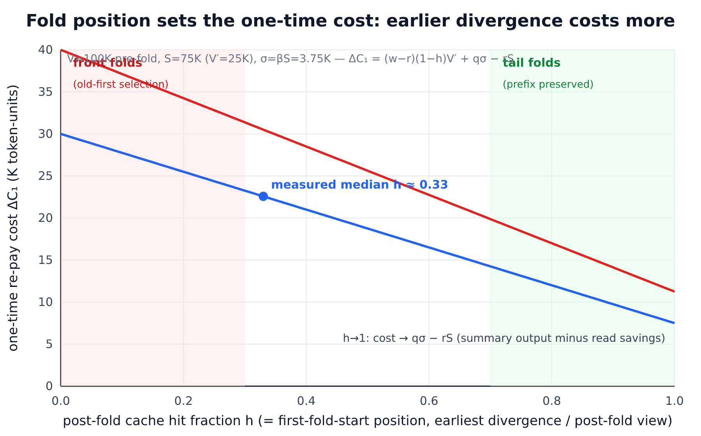
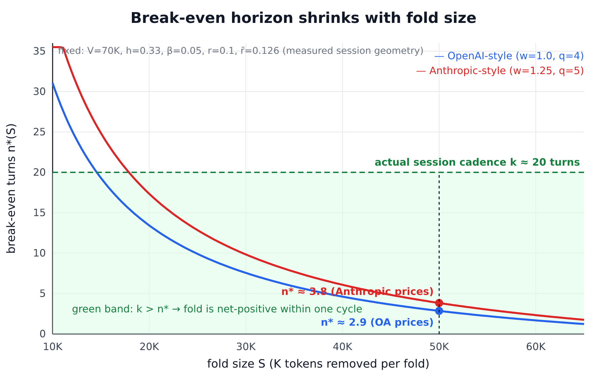
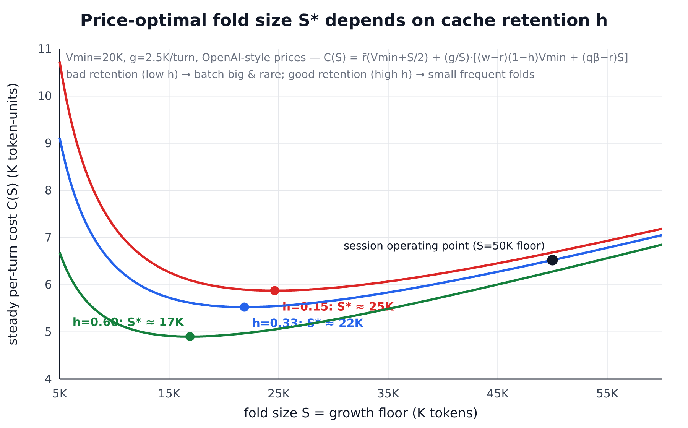
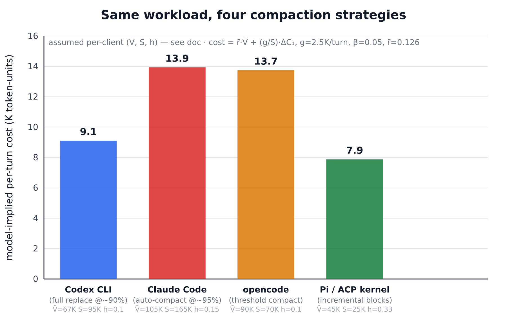
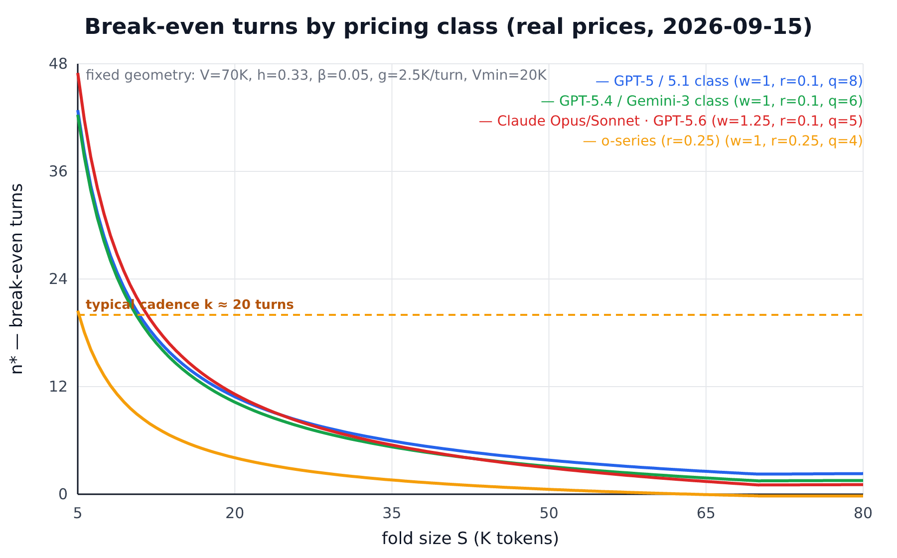
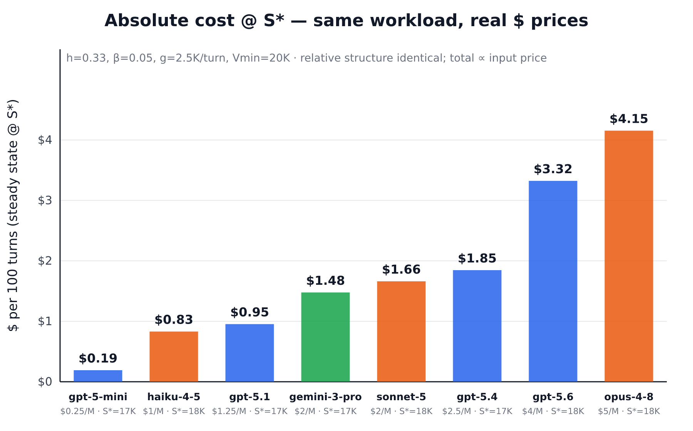

# Compression Economics: A Cost Model for Context Folding

Analytical record for [issue #359](https://github.com/ranxianglei/billion-context-pi/issues/359).
Derives a price-based model for context folding (compression), compares mainstream
clients' compaction strategies under one set of formulas, and states the policy
implications for this project. All client comparisons use **documented assumptions**,
not measurements — see §4 caveats.

Charts: [`assets/compression-economics/`](assets/compression-economics/) (generated by
`gen.mjs`, run `node gen.mjs <out-dir>`; SVG→PNG via resvg).

---

## 1. Scope and conventions

**Priced:** prompt tokens (input / cache-write / cache-read) and summary-generation
output tokens. **Not priced:** information-quality degradation from aggressive folding
— a task failure costs far more than any token savings; treated as a constraint, not a
term (§6).

### Price parameters (per token, normalized to non-cached input price = 1)

| Symbol | Meaning | OpenAI-style | Anthropic-style |
|--------|---------|--------------|-----------------|
| `w`    | cache-write premium: `p_cw = w·p_in` | 1.0 | 1.25 |
| `r`    | cache-read ratio: `p_cr = r·p_in`   | 0.1 | 0.1 |
| `q`    | output ratio: `p_out = q·p_in`      | ~4  | ~5 |
| TTL    | prefix-cache expiry between requests | ~5 min | ~5 min |

Example computations below use `w=1.0, q=4` (OpenAI-style) and `w=1.25, q=5`
(Anthropic-style), `r=0.1`.

### Geometry variables

| Symbol | Meaning |
|--------|---------|
| `V`    | pre-fold view size (tokens sent as prompt) |
| `S`    | tokens removed by a fold |
| `V′`   | post-fold view = `V − S` |
| `X`    | first divergence byte vs the previous render (prefix shared with last request) |
| `h`    | post-fold cache-hit fraction = `X / V′` (measured per fold) |
| `f`    | pre-fold position fraction = `X / V` (= `firstFoldStartPct`, logged since PR #447) |
| `σ`    | summary output tokens per fold = `βS`, with `β ≈ 0.04–0.08` (median ~0.05) |
| `k`    | turns between folds (cadence) |
| `g`    | net view growth per turn (K tokens) |
| `L`    | hard window limit |
| `r̄`    | blended price of a typical view token = `r + (g/V)(w−r)` ≈ **0.126** at session values (`g≈2K`, `V≈70K`) |

`f` and `h` are equivalent parameterizations: `f = h(1 − S/V)`. Logs report `f`;
provider usage reports make `h` directly measurable (§5).

## 2. Core formulas

### 2.1 Steady state (no fold)

A turn sends view `V`; only the new tail (~`g` tokens) is written, the rest is read:

```
C_ss(turn) ≈ r̄·V + q·o        (o = output tokens/turn; drops out of all comparisons)
```

### 2.2 One-time cost of a fold

After a fold, the next request shares only the prefix up to `X` with the previous
render. Everything after `X` is written fresh instead of read:

```
ΔC₁(h,S) = (w−r)(1−h)(V−S) + q·βS − rS
           └── re-pay premium ──┘   └summary┘  └read value of removed S┘
```

- `(w−r)(1−h)V′`: the tail that would have been a cache *read* becomes a cache *write* —
  only the **premium** is new cost, because the baseline turn was reading those bytes.
- `+ q·βS`: the summary is model output, priced at the output rate. At `β=0.05, q=4`
  this is `0.2S` — same magnitude as the re-pay term. This is the term most informal
  analyses miss.
- `− rS`: the removed tokens no longer cost anything.

**Upper-bound convention.** If you cannot assume the baseline would have been a cache
hit (e.g., the previous request already expired via TTL), charge the full write price on
the re-paid tail `T = (1−h)V′`:

```
ΔC₁^UB = w(1−h)V′ + q·βS − rS   ≥   ΔC₁(exact)
```

Both conventions are used in §3; they bracket the answer and never change its sign.



### 2.3 Per-turn saving after the fold

The original `S` tokens leave the view forever; the `σ`-token summary stays:

```
Δs = (S − σ)·r̄ = (1−β)·S·r̄
```

### 2.4 Break-even horizon

Turns needed for cumulative savings to repay the one-time cost:

```
n*(S,h) = ΔC₁(h,S) / ((1−β)·S·r̄)
```

**Monotonicity.** For fixed `h`, `ΔC₁` *decreases* in `S` (smaller post-fold view →
smaller re-pay tail) while `Δs` *increases* in `S`. Therefore `n*(S)` is **strictly
decreasing in S**: under pure pricing, bigger folds always break even faster. The real
bounds on `S` are the window cap (`S ≤ L − Vmin`) and unpriced information loss (§6).



### 2.5 Optimal fold size in an oscillating regime

Folding holds the view between `Vmin` and `Vmin+S`; folds recur every `k = S/g` turns.
Average per-turn cost:

```
C(S) = r̄(Vmin + S/2)  +  (g/S)·[(w−r)(1−h)Vmin + (qβ−r)S]
       └── avg view ──┘     └ amortized one-time cost ┘
```

Setting `dC/dS = 0` gives an interior optimum whenever `qβ > r` (summary output costs
more than the read savings it replaces — true whenever `β > r/q = 0.025`):

```
S* = sqrt( 2·g·(w−r)·(1−h)·Vmin / r̄ )
```

Reading `S*`: fast growth `g`, poor retention `h`, or high floor `Vmin` → batch bigger
and fold less often; good retention → smaller, more frequent folds. **This is the
mechanism behind "different models have different sweet spots"** — every factor in
`S*` varies across models/providers/workloads.



### 2.6 Cadence constraint

A fold cycle is profitable only if it pays back before the next fold:

```
k ≥ n*(S)
```

Combined with `S ≤ L − Vmin` this defines the feasible operating region. The two knobs
are independent: `S` sets steady-state cost (§2.5), `k` sets how often you pay
`ΔC₁` — but note `k = S/g` couples them in growth-driven policies (fold when growth
since last fold reaches `S`), which is exactly what `nudgeGrowthTokens` implements.

### 2.7 Cache-TTL extension

If the inter-request gap exceeds TTL (~5 min), the whole prefix expires and the next
request pays `w` on the entire view regardless of folding. With idle probability
`P_idle`:

```
r_eff = r + P_idle·(w−r)
```

Tight agentic loops: `P_idle ≈ 0`, TTL irrelevant. Interactive sessions with human
delays: `P_idle` large → steady-state cost rises toward `w·V`, and a fold's re-pay
premium matters less (the cache was going to die anyway). Implication: cadence should
not be driven purely by growth when long idle gaps are expected.

## 3. Worked example: the #359 session

Measured geometry (gpt-6-astra, 6.5 h, 513 requests): `V≈70K`, `S≈50K`, median
post-fold hit `h≈0.33`, `σ≈2.5K` (`β=0.05`), growth `g≈2.5K`/turn, actual cadence
`k≈20` turns/fold. Prices: OpenAI-style `w=1, q=4`, `r=0.1`, `r̄=0.126`.

Exact formula:

```
ΔC₁  = 0.9 × 0.67 × 20K + 4×0.05×50K − 0.1×50K
     = 12.06K + 10K − 5K = 17.1K units
Δs   = 0.95 × 50K × 0.126 = 6.0K units/turn
n*   = 17.1 / 6.0 ≈ 2.9 turns
```

Convention sensitivity: upper-bound pricing gives `n* ≈ 3.1`; using `r` instead of
`r̄` for the saving rate gives `n* ≈ 3.6`; Anthropic-style prices give `n* ≈ 3.8`
(exact). The earlier hand analysis landed on 4–5 turns using the upper-bound
convention with per-fold `T` measured from the largest folds. All variants agree on
the operative fact:

```
n* ∈ [3, 5]   ≪   k ≈ 20 actual turns between folds
```

**Every fold repays within a quarter of its cycle — folding is net-positive, not
"barely breaks even."** The user-perceived "cache leak" is the hit-rate drop plus the
first-request prefill latency spike after each fold, not an economic loss.

Steady-state check against §2.5 (`Vmin=20K`, `g=2.5K`, `h=0.33`):
price-optimum `S* ≈ 22K` with `C(S*) ≈ 5.5` K-units/turn, versus the session's
operating point `S=50K` at `C(50K) ≈ 6.5` — roughly **18% above the price-optimal
steady-state cost**. Smaller, more frequent folds would save ~1 K-unit/turn (~15% of
prompt cost) *if information quality tolerates them* — the unpriced term decides.

## 4. Client comparison

Mapping each client's compaction scheme onto the same variables. Operating points
`(V̄, S, h)` are **assumed** from documented behavior, not measurements; provider
prices as in §1. Per-turn cost `= r̄·V̄ + (g/S)·ΔC₁`, `g=2.5K`, `β=0.05`, `r̄=0.126`.

| Client | Scheme | Trigger | Post-fold hit `h` | Assumed `(V̄, S)` | Provider | Cost (K units/turn) |
|--------|--------|---------|-------------------|------------------|----------|---------------------|
| Codex CLI | full-replace compaction (summarize history → compact state + recent tail) | near hard limit (~90%) | ~0.10 | (67K, 95K) | OA | **9.1** |
| Claude Code | auto-compact + micro-compaction (in-place truncation of old tool outputs) | ~95% of window | ~0.15 | (105K, 165K) | Anthropic | **13.9** |
| opencode | threshold compaction (summarize + keep recent tail) | threshold % of limit | ~0.10 | (90K, 70K) | Anthropic | **13.7** |
| Pi / ACP kernel | incremental block folding, oldest-first, byte-stable rendering, tiered distillation, protected recent zone | growth floor (`nudgeGrowthTokens`) | ~0.33 (median, rises with session age) | (45K, 25K) | OA | **7.9** |



**Structural observations**

1. **Replace-style schemes** maximize `S` (good for `n*`) but reset the entire prefix
   (`h→0`) at the top of the window (high `V̄`). They pay the `(w−r)(1−h)V′` premium on
   nearly the whole view once per cycle, and live at maximum steady-state view cost.
2. **Incremental block folding** keeps `V̄` low and preserves the prefix: the stable
   core (block region) grows monotonically as folds proceed left-to-right over a
   byte-stable render, so `h` improves with session age. Each small fold still incurs
   `q·σ` output cost — tiered distillation (T2/T3 rewrite existing blocks instead of
   appending fresh summaries) keeps total `σ` bounded.
3. **Micro-compaction** (Claude Code style) is a series of positional point-folds: each
   in-place truncation invalidates everything after its cut point. Scattered
   truncations multiply re-pay premiums; batching them is strictly cheaper.
4. **Price parameters shift the sweet spot.** Anthropic pricing raises the weight of
   the write premium (`w=1.25`) and output cost (`q=5`) → favors higher-`h` strategies
   and larger `S*` more strongly. Cheaper-output models tolerate more frequent small
   folds (smaller `S*`). This is why no single global threshold is right (§5).

*Caveats:* assumed operating points, not measurements; client internals evolve; the
table compares strategy structure, not absolute performance. Re-run the arithmetic
with measured `(V̄, S, h)` from logs before drawing conclusions about any specific
release.

## 5. Policy implications for this project

1. **No global default threshold.** `S*` depends on model/provider params and workload
   (`g`, achievable `h`), so a single shipped default is wrong by construction. Keep
   `nudgeGrowthTokens` user-tunable (as-is) and document the formula so users can tune
   per model — consistent with the #359 ruling ("不同模型甜点不一样").
2. **Cadence guardrail.** A nudge should not force another fold before break-even
   (`k < n*(S)`) unless pressure demands it (emergency path unchanged).
3. **Observability makes the model self-calibrating.** PR #447 adds
   `firstFoldStartPct` (`f`) and `retainedPctUpperBound` (`V′/V`) to `event=applied`.
   Combined with provider-reported cached-token counts, `h` becomes directly readable
   from logs — users can compute their own `n*` and `S*` without experiments.
4. **Partial late-folding (item 3 of #359)** remains optional. The economics agree with
   deprioritizing it: late-position folds (high `h`) are cheapest, and incremental
   selection already moves the divergence point forward over time.

## 6. Model limitations

- **Unpriced quality term.** Aggressive folding degrades task performance; the true
  objective is `token cost + task-failure cost`. The price-optimal `S*` is a lower
  bound on the sensible fold size, not a target.
- Prefix-based caching with instant invalidation past the first divergent byte (true
  for OpenAI/Anthropic today); other caching schemes would change §2.2.
- Single-session model; delegation/multi-agent forks multiply views and need separate
  accounting.
- `β` and `h` treated as constants; both drift as sessions age (block accumulation
  raises `h`; summary density changes `β`).
- Prices change; all formulas are parameterized so re-plugging numbers is trivial.

## 7. Estimator & live pricing (2026-09-15)

### 7.1 Interactive estimator

`estimator/index.html` — self-contained, zero-dependency page (offline-capable,
opens in any browser). Sliders for V, S, h, β, g, Vmin, k plus a price preset for
every model in §7.2 (or fully custom w/r/q). Live outputs: ΔC₁ (K units and $),
Δs, n\*(S), S\*, C(S), $/100 turns, and a verdict banner comparing the configured
cadence k against n\*. Two live charts: the break-even curve with the cadence line,
and the steady-state cost curve with S\* and the operating point marked.

Hosted (GitHub Pages, on the PR #448 branch until merge): <https://ranxianglei.github.io/billion-context-pi/estimator/>. After merge, repoint the Pages source to `master`. The file also opens directly from any checkout (no server needed).

### 7.2 Mainstream model pricing (fetched 2026-09-15)

Source: [BerriAI/litellm](https://github.com/BerriAI/litellm)
`model_prices_and_context_window.json`, commit `7e3ca14`. USD per M tokens;
derived normalized params w = cacheWrite/input, r = cacheRead/input,
q = output/input (missing cacheWrite ⇒ w = 1.0):

| Model | input | output | cache read | cache write | w | r | q | max ctx |
|-------|-------|--------|-----------|-------------|------|------|---|---------|
| gpt-5.6 | 4.00 | 20 | 0.40 | 5.00 | 1.25 | 0.10 | 5 | 128K |
| gpt-5.5 | 5.00 | 30 | 0.50 | – | 1.00 | 0.10 | 6 | 128K |
| gpt-5.4 | 2.50 | 15 | 0.25 | – | 1.00 | 0.10 | 6 | 128K |
| gpt-5.4-mini | 0.75 | 4.5 | 0.075 | – | 1.00 | 0.10 | 6 | 128K |
| gpt-5.1 / gpt-5 | 1.25 | 10 | 0.125 | – | 1.00 | 0.10 | 8 | 128K |
| gpt-5-mini | 0.25 | 2 | 0.025 | – | 1.00 | 0.10 | 8 | 128K |
| o3 | 2.00 | 8 | 0.50 | – | 1.00 | 0.25 | 4 | 100K |
| o4-mini | 1.10 | 4.4 | 0.275 | – | 1.00 | 0.25 | 4 | 100K |
| claude-opus-4-8 | 5.00 | 25 | 0.50 | 6.25 | 1.25 | 0.10 | 5 | 128K |
| claude-sonnet-5 | 2.00 | 10 | 0.20 | 2.50 | 1.25 | 0.10 | 5 | 128K |
| claude-sonnet-4-6 | 3.00 | 15 | 0.30 | 3.75 | 1.25 | 0.10 | 5 | 128K |
| claude-haiku-4-5 | 1.00 | 5 | 0.10 | 1.25 | 1.25 | 0.10 | 5 | 64K |
| gemini-2.5-pro | 1.25 | 10 | 0.125 | – | 1.00 | 0.10 | 8 | 65K |
| gemini-3-pro-preview | 2.00 | 12 | 0.20 | – | 1.00 | 0.10 | 6 | 65K |
| gemini-3.5-flash | 1.50 | 9 | 0.15 | – | 1.00 | 0.10 | 6 | 65K |

> **Caveat — Gemini:** litellm's Gemini cache-read values reflect Google's
> context-caching discount; Google's caching mechanism (separate storage fees,
> different TTL semantics) does not map 1:1 onto prefix caching, so the w/r
> mapping for Gemini rows is approximate.

**Finding.** Current-generation list prices are far more homogeneous than the
uniform-r assumption of §1–§4 suggested: every major family now prices cache
reads at ≈0.1× input (the 0.5× figures that circulated for OpenAI are
GPT-4o-era), cache writes at 1.0× or 1.25×, and output ratios cluster at
q ∈ {4, 5, 6, 8}. Under fixed geometry (V=70K, h=0.33, β=0.05, g=2.5K/turn,
Vmin=20K):

- Break-even turns n\*(S) span only ≈3.4–4.3 across all pricing classes at
  S=50K — the fold decision is effectively **model-independent**; geometry
  (h, g, Vmin) sets the sweet spot, and the price table only scales absolute $.
- The interior optimum lands at S\* ≈ 21K (w=1) / 23K (w=1.25) regardless of
  vendor — same conclusion.
- Absolute steady-state cost at S\* scales with input price: $0.19/100 turns
  (gpt-5-mini) → $4.15/100 turns (claude-opus-4-8).





### 7.3 `/acp` economics readout (proposed, not implemented)

Feasibility: high. The `acp_status` overview already appends extra sections
(nudge state, ranges); last-fold geometry can be recomputed on demand via
`firstFoldStartTokens()` (PR #447) from data already available in the status
handler, so no state-schema change is needed. Proposed config surface: an
optional `priceProfile` ({w,r,q} or a $/M triple) on the adapter config; when
set, `/acp` would show V, last-fold h, S, n\*(S), S\*, and a cadence verdict.
Awaiting owner sign-off before implementation.

## References

- [#359](https://github.com/ranxianglei/billion-context-pi/issues/359) — byte-level
  probe results, corrected economics, scope ruling
- [#171](https://github.com/ranxianglei/billion-context-pi/issues/171) — stable tag
  tokens (precondition for byte-stable renders)
- [PR #447](https://github.com/ranxianglei/billion-context-pi/pull/447) — fold-invalidation
  geometry fields on `event=applied`
